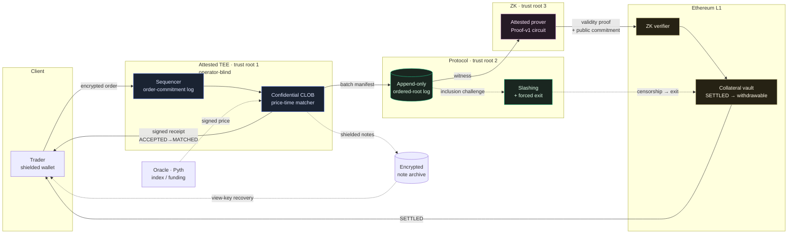

# dark-perp

**A fast + dark perpetual-futures protocol.** Low-latency confidential matching
inside an attested TEE, fund safety from ZK validity proofs on Ethereum,
sequencing accountability from an order-commitment log + slashing, and
liveness/recovery from forced exit + an encrypted note archive.

> Tek cümle: *Attested TEE içinde low-latency confidential CLOB (hız +
> operatör-kör dark), append-only order-commitment log + slashing ile sequencing
> accountability, forced-exit + note archive ile liveness/recovery, attested
> confidential prover ile witness gizliliği, asenkron ZK validity proof ile L1
> vault safety, shielded note state ile public privacy.*

The full architecture (v2, Turkish) lives in [`docs/ARCHITECTURE.md`](docs/ARCHITECTURE.md).
The design decisions taken while building are in [`docs/DECISIONS.md`](docs/DECISIONS.md),
the phased build plan in [`docs/ROADMAP.md`](docs/ROADMAP.md), the threat model in
[`docs/SECURITY.md`](docs/SECURITY.md), the proving boundary in
[`docs/PROVING.md`](docs/PROVING.md), and build/test instructions in
[`docs/TESTING.md`](docs/TESTING.md).

## Three trust roots, three layers

The thesis: speed and darkness physically fight; the component that gives both at
practical latency is a TEE — but a TEE **moves** trust, it does not remove it, and
fairness / liveness / recovery are *separate* protocol obligations.

| Root | Provides | Does **not** provide |
|---|---|---|
| **TEE** — low-latency confidential execution | operator-blind matching, native-speed continuous CLOB | liveness, fairness, censorship-resistance, recovery |
| **Protocol** — order-commitment log + forced exit + slashing | sequencing accountability, liveness, fair access | confidentiality, fund validity |
| **ZK** — fund-safety / state-validity root | vault safety, valid state transitions | inclusion / ordering / censorship (on its own) |

If the TEE breaks, funds **cannot be stolen** (ZK protects the vault) — but
confidentiality, fair access, preconfirmation reliability and market integrity
can. We label that honestly rather than calling the enclave an untouchable black
box. See §10 of the architecture.

## The hot path, at a glance

How an order flows from a client to L1 settlement, and where each trust root
sits. The ASCII version with full annotations is in
[`docs/ARCHITECTURE.md`](docs/ARCHITECTURE.md) §1.



The solid path is the latency-critical loop; dashed edges are the side flows that
keep the protocol honest when the TEE or operator misbehaves — oracle pricing,
inclusion challenges, forced exit, and view-key recovery from the note archive.

## Repository status

The protocol is built bottom-up across the [roadmap](docs/ROADMAP.md) phases — all
six phases now have implemented deliverables. Tested end-to-end: **137 Rust + 31
Solidity + 36 frontend tests** (green in debug *and* release) — including a
CI-locked node-lifecycle test driving the full funding → liquidation →
conservation loop, adversarial oracle-adapter tests proving a manipulated
external feed is rejected by the §8 gate rather than silently marked, and a
design-token discipline test that fails CI if any brand colour is hard-coded
outside the themeable `:root` block — **13 property/stateful fuzzers**, clippy `-D warnings` +
`cargo fmt --check` clean, a
**real SP1 zkVM guest that executes and matches native byte-for-byte**
([`crates/sp1-guest`](crates/sp1-guest) + [`crates/sp1-host`](crates/sp1-host)), a
**live Crypto.com oracle** wired at both the UI and the protocol layer
([`crates/oracle-feed`](crates/oracle-feed)), an order-book
[stress-test bot](crates/loadbot), a runnable [`demo`](crates/demo), and a
built+headless-verified frontend with 5 live USDC markets. The core
math, services, and contracts were hardened through **fifteen adversarial review
passes** covering every module (six Rust core, two sequencer, three Solidity, one
committee/bridge/note-archive pass, one matcher CLOB pass, one prover boundary
pass, one on the new oracle/bot code) — every finding fixed with a regression test
(see [`docs/SECURITY.md`](docs/SECURITY.md)).

| Component | Crate / dir | Phase | Arch |
|---|---|---|---|
| Deterministic state-transition core (note tree, risk, Proof-v1 invariants) | [`crates/perp-core`](crates/perp-core) | 0 | §1,§4,§12 |
| Price-time CLOB matcher (IOC/FOK/post-only/GTC, STP) | [`crates/matcher`](crates/matcher) | 1 | §1,§4 |
| Sequencer spine: receipts, manifests, finality, inclusion slashing, funding/liquidation loop, pre-trade risk, batch rollback | [`crates/sequencer`](crates/sequencer) | 1–3 | §2,§3,§5,§6 |
| ZK proving harness + §10b confidential-proving boundary | [`crates/prover`](crates/prover) | 2 | §4,§10b |
| Encrypted note archive + view-key recovery | [`crates/note-archive`](crates/note-archive) | 2 | §7 |
| L1 settlement: root anchoring, liveness/close-only, bonded inclusion slashing, vault, deploy script | [`contracts/`](contracts) | 2 | §2,§3,§6 |
| Committee-of-enclaves: Shamir t-of-n order keys + quorum preconf | [`crates/committee`](crates/committee) | 5 | §11 |
| Privacy bridge: amount-bucketing + batching/mixing | [`crates/bridge`](crates/bridge) | 4 | §13,§9 |
| End-to-end integration + narrated demo | [`crates/e2e`](crates/e2e), [`crates/demo`](crates/demo) | — | all |
| Running node: live operating loop (oracle → maintenance → seal) | [`crates/node`](crates/node) | — | §5,§8 |
| Order-book stress-test bot (throughput / latency / invariants) | [`crates/loadbot`](crates/loadbot) | — | §1 |
| Live oracle adapter (Crypto.com ticker → `OracleTranscript`) | [`crates/oracle-feed`](crates/oracle-feed) | — | §8 |
| Multi-market web client (finality UX, close/cancel, toasts, responsive), design-ready | [`frontend/`](frontend) | — | §3,§6,§7 |
| CI (Rust + Foundry + frontend) | [`.github/workflows`](.github/workflows) | — | — |

The Rust core and Solidity contracts are bound by **byte-exact cross-layer
vectors** ([`crates/prover/tests/vectors.rs`](crates/prover/tests/vectors.rs) ↔
[`contracts/test/CrossLayer.t.sol`](contracts/test/CrossLayer.t.sol)): a receipt
signed in Rust recovers on-chain via `ecrecover`, and the proof public-input
commitment matches on both sides.

### [`crates/perp-core`](crates/perp-core) — deterministic state-transition core

Written **once**, run in **two** places: natively in the sequencer (hot path) and
**unchanged inside a zkVM guest** (SP1/Risc0 → RISC-V) where it becomes the
Proof-v1 validity circuit. To make that possible it is `#![no_std]` (with
`alloc`), with **no floats, clocks, randomness, or I/O** — every transition is a
pure function of its inputs.

It implements and tests all six **Proof-v1** invariants (§4):

1. **collateral conservation** — `Σ notes + Σ position collateral + insurance + vault_pool == external_in − external_out`, asserted after every op
2. **valid nullifiers / no double-spend** — append-only nullifier set
3. **post-fill margin sufficiency** — increasing side must meet initial margin at the oracle mark
4. **oracle freshness + confidence + deviation** — transcript sanity gates (§8)
5. **funding correctness** — clamped funding rate + cumulative index
6. **liquidation threshold** — equity vs maintenance margin, offline-safe (§5)

Plus the accountability/recovery scaffolding: signed-receipt + batch-manifest
types (§2), three-layer finality `ACCEPTED / MATCHED / SETTLED` where **only
SETTLED is withdrawable** (§3), and a **close-only / forced-exit** mode (§6).

## Build & test

```bash
cargo test                                       # native: 44 tests (unit + lifecycle)
cargo build -p perp-core --no-default-features   # proves the no_std zkVM-guest build
cargo clippy --all-targets                       # clean
```

## What is intentionally NOT here yet

- **Real ZK backend.** The host prover is still a documented commitment-based
  stand-in, but the **real SP1 zkVM guest exists, builds, and runs**: the unchanged
  `perp-core` engine compiles to a `riscv32im-succinct-zkvm-elf`
  ([`crates/sp1-guest`](crates/sp1-guest), `cargo prove build`), and
  [`crates/sp1-host`](crates/sp1-host) **executes it and verifies the committed
  value is byte-for-byte identical to native `perp-core`** (248,477 cycles, same
  commitment — see [`docs/PROVING.md`](docs/PROVING.md)). Full STARK proving is the
  same call with `.prove()`. `MockZkVerifier` likewise stands in for the generated
  Solidity verifier.
- **TEE attestation.** Enclave keys/measurements are modelled as values; real
  TDX/Nitro attestation verification is Phase 1 production.
- **Proof-v2 (matching determinism).** The matcher is deterministic and tested,
  but matching fairness is not yet *proven* in ZK — in the interim it is backed by
  receipts + manifest + slashing (§2). Phase 3.
- **Pre-trade risk.** Margin is checked at settlement; rejecting unmarginable
  orders *before* matching is Phase 3 (see `crates/sequencer`).
- **Aztec privacy bridge** (Phase 4) and **committee-of-enclaves** (Phase 5).

See [`docs/ROADMAP.md`](docs/ROADMAP.md) for the full phase map.
