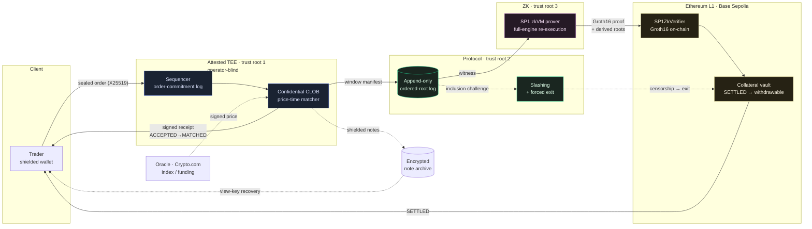

# Arcora Perp

**A privacy-preserving perpetual-futures DEX.** Low-latency confidential matching
inside an attested TEE, fund safety from **real ZK validity proofs on Ethereum**,
sequencing accountability from an order-commitment log + slashing, and
liveness/recovery from forced exit + an encrypted note archive.

> **Live public testnet alpha** — [perp.arcoralabs.xyz](https://perp.arcoralabs.xyz)
> (Base Sepolia). Docs: [perpdocs.arcoralabs.xyz](https://perpdocs.arcoralabs.xyz) ·
> Technical brief: [`docs/litepaper`](docs/litepaper/arcora-perp-litepaper.md).
> Codename in-repo: `dark-perp`.

One line: *confidential matching in an attested TEE, proof-gated public settlement,
permissionless Merkle claims from settled withdrawal roots, sequencing accountability
from signed receipts + slashing, and shielded balances.* **Alpha trust boundary:** the
gateway is still a trusted/custodial component: it holds server-custody spend keys and
the oracle publisher authority. ZK proves the transition implemented by the guest; it
does not independently prove user intent or external price truth.

The full architecture (v2, Turkish) lives in [`docs/ARCHITECTURE.md`](docs/ARCHITECTURE.md).
The design decisions taken while building are in [`docs/DECISIONS.md`](docs/DECISIONS.md),
the phased build plan in [`docs/ROADMAP.md`](docs/ROADMAP.md), the threat model in
[`docs/SECURITY.md`](docs/SECURITY.md), the proving boundary in
[`docs/PROVING.md`](docs/PROVING.md), build/test instructions in
[`docs/TESTING.md`](docs/TESTING.md), the full-codebase adversarial hardening
pass (every fix + what was verified correct) in [`docs/HARDENING.md`](docs/HARDENING.md),
and the economic-security audit (bond sizing, insurance backstop, auto-deleverage,
maker incentives, liquidation privacy — seven hard questions answered head-on) in
[`docs/ECONOMIC_SECURITY.md`](docs/ECONOMIC_SECURITY.md).

## Three trust roots, three layers

The thesis: speed and darkness physically fight; the component that gives both at
practical latency is a TEE — but a TEE **moves** trust, it does not remove it, and
fairness / liveness / recovery are *separate* protocol obligations.

| Root | Provides | Does **not** provide |
|---|---|---|
| **TEE** — low-latency confidential execution | operator-blind matching, native-speed continuous CLOB | liveness, fairness, censorship-resistance, recovery |
| **Protocol** — order-commitment log + forced exit + slashing | sequencing accountability, liveness, fair access | confidentiality, fund validity |
| **ZK** — fund-safety / state-validity root | vault safety, valid state transitions | inclusion / ordering / censorship (on its own) |

If only TEE confidentiality fails, private order/position data can leak while the
proof and vault checks still apply. A broader gateway compromise is different: the
alpha gateway also holds server-custody spend keys and oracle-publisher authority, so
it is a fund-safety and market-integrity trust dependency. ZK rejects transitions
that violate the guest program; it does not turn compromised custody keys or a
gateway-signed false-but-valid oracle transcript into independently authenticated
user intent or external price truth. See the threat model before treating this as a
non-custodial system.

## The hot path, at a glance

How an order flows from a client to L1 settlement, and where each trust root
sits. The ASCII version with full annotations is in
[`docs/ARCHITECTURE.md`](docs/ARCHITECTURE.md) §1.



The solid path is the latency-critical loop; dashed edges are the side flows that
keep the protocol honest when the TEE or operator misbehaves — oracle pricing,
inclusion challenges, forced exit, and view-key recovery from the note archive.

## Live public testnet alpha (Base Sepolia)

A single-enclave public testnet is **live** at
[perp.arcoralabs.xyz](https://perp.arcoralabs.xyz): the gateway runs inside a real
**Azure TDX confidential VM** (`Standard_DC2es_v6`), verifying its **own** live
TDX + vTPM quote at boot and binding the enclave identity to the measured-boot
measurement (`docs/ATTESTATION.md`). Each ~window it seals trading activity, a
**real SP1 zkVM proof re-executes the whole engine** into a **Groth16** proof
verified on-chain in `settleBatch`, and it persists engine state across restarts
(sealed snapshots + a rollback-journal WAL, on-chain-root continuity checked at
boot). **Funds are test USDC and carry no value.**

**What is real vs. what is a stand-in** (labelled honestly, in the UI too):

| Surface | State on the testnet |
|---|---|
| Confidential matching in an attested TEE | **Real** — live Azure TDX quote verified at boot; wrong-measurement boots refuse |
| **ZK validity proof (fund safety)** | **Real** — SP1 zkVM full-engine re-execution → Groth16 verified on-chain by `SP1ZkVerifier`; the operator cannot settle a transition the proof does not attest (prev-root continuity + six roots derived in-guest) |
| **Order confidentiality on the wire** | **Real** — orders are sealed client-side to the enclave's rotating X25519 epoch key (sealed-box); the wire carries only ciphertext, TLS on top |
| L1 settlement + USDC deposit/withdraw/claim | **Real** — Base Sepolia; withdrawals root; permissionless `vault.claim` pays out to the leaf-bound address |
| State persistence + crash recovery | **Real** — sealed snapshot + rollback-journal WAL; a restart mid-settle self-recovers at boot (drilled live) |
| Sequencing accountability (rate limits, caller-signed orders, inclusion challenges) | **Real** — enforced in the gateway + on-chain challenge game / bond slashing |
| **ZK prover attestation** | **Stand-in** — the prover runs on a development machine (stub measurement); the witness leaves the enclave sealed but the prover host is **not yet TEE-attested** (roadmap: attested x86_64 prover) |
| **Operator liveness** | **Single point of failure** — if the sequencer stops, trading halts; settled funds stay withdrawable via forced-exit after the liveness window |
| **Matching-fairness proof** | **Not yet** — the proof attests correct *execution* of the sequenced ops; the *ordering* itself is enclave-attested only (roadmap: Proof v2) |

Proof enforcement is cryptographic within its stated boundary: a state transition
that does not satisfy the zk guest cannot pass the on-chain verifier. That statement
does **not** remove the alpha gateway's custody/oracle trust. The honest limits — a
non-attested dev prover, gateway-held spend keys and oracle authority, operator liveness as a
SPOF, ordering fairness not yet zk-proven, ~10–20 min proof cadence, and no
third-party audit — are documented in full on the
[Security & Trust](https://perpdocs.arcoralabs.xyz/security.html) page. Get test
USDC via the in-app **"Get test USDC"** button (open-mint MockUSDC), the docs
[quickstart](https://perpdocs.arcoralabs.xyz/quickstart.html), or the faucet
snippet in `docs/API.md`.

**Live contracts** (Base Sepolia, deployed 2026-07-09):

| Contract | Address |
|---|---|
| `DarkPerpSettlement` | [`0xf5D6Aa9CC96E2ac8AC5564df5E8475bDb13BCDCF`](https://sepolia.basescan.org/address/0xf5D6Aa9CC96E2ac8AC5564df5E8475bDb13BCDCF) |
| `CollateralVault` | [`0xC3EBc0f7301D5a914b01b8d2a1B5574764330c05`](https://sepolia.basescan.org/address/0xC3EBc0f7301D5a914b01b8d2a1B5574764330c05) |
| `SP1ZkVerifier` | [`0x8012F3b35B9884f86a3F8f39B79e82eC410E1160`](https://sepolia.basescan.org/address/0x8012F3b35B9884f86a3F8f39B79e82eC410E1160) |
| `MockUSDC` (open mint, 6dp) | [`0x9F5365c947eCaBaf62f42EF0Fe92ab909f709bDA`](https://sepolia.basescan.org/address/0x9F5365c947eCaBaf62f42EF0Fe92ab909f709bDA) |

Markets: BTC / ETH / SOL perpetuals. See
[`contracts/deployments/base-sepolia.json`](contracts/deployments/base-sepolia.json)
for the canonical record (incl. superseded deploys).

## Repository status

The protocol is built bottom-up across the [roadmap](docs/ROADMAP.md) phases and
now runs as a live testnet alpha with **real Groth16 settlement on-chain**. Tested
end-to-end: **351 Rust + Solidity workspace tests + 161 frontend tests** (green in
debug *and* release) — including proof-replay merge gates (a sealed window replays
to the settled state root), crash-recovery drills (a restart mid-settle rolls back
or forward from the sealed WAL and reconciles against the chain), a CI-locked
node-lifecycle test driving the full funding → liquidation → conservation loop,
adversarial oracle-adapter tests, and a self-healing live-oracle fallback. Property
& stateful fuzzers, clippy `-D warnings` + `cargo fmt --check` clean, a
**real SP1 zkVM guest that executes and matches native byte-for-byte**
([`crates/sp1-guest`](crates/sp1-guest) + [`crates/sp1-host`](crates/sp1-host)) now
wired end-to-end through the attested [`prover-service`](crates/prover-service) to
on-chain verification, a **live Crypto.com oracle**
([`crates/oracle-feed`](crates/oracle-feed)), an order-book
[stress-test bot](crates/loadbot), a runnable [`demo`](crates/demo), and a
built+deployed frontend (BTC/ETH/SOL markets, wallet-connect deposit & claim). The
core math, services, and contracts were hardened through many adversarial review
passes covering every module — every finding fixed with a regression test (see
[`docs/SECURITY.md`](docs/SECURITY.md) and [`docs/HARDENING.md`](docs/HARDENING.md)).

| Component | Crate / dir | Phase | Arch |
|---|---|---|---|
| Deterministic state-transition core (note tree, risk, Proof-v1 invariants) | [`crates/perp-core`](crates/perp-core) | 0 | §1,§4,§12 |
| Price-time CLOB matcher (IOC/FOK/post-only/GTC, STP) | [`crates/matcher`](crates/matcher) | 1 | §1,§4 |
| Sequencer spine: receipts, manifests, finality, inclusion slashing, funding/liquidation loop, pre-trade risk, batch rollback | [`crates/sequencer`](crates/sequencer) | 1–3 | §2,§3,§5,§6 |
| ZK proving harness + §10b confidential-proving boundary | [`crates/prover`](crates/prover) | 2 | §4,§10b |
| Encrypted note archive + view-key recovery | [`crates/note-archive`](crates/note-archive) | 2 | §7 |
| L1 settlement: root anchoring, liveness/close-only, bonded inclusion slashing, vault, deploy script | [`contracts/`](contracts) | 2 | §2,§3,§6 |
| Committee-of-enclaves: Shamir t-of-n order keys + quorum preconf | [`crates/committee`](crates/committee) | 5 | §11 |
| Privacy bridge: amount-bucketing + batching/mixing | [`crates/bridge`](crates/bridge) | 4 | §13,§9 |
| End-to-end integration + narrated demo | [`crates/e2e`](crates/e2e), [`crates/demo`](crates/demo) | — | all |
| Running node: live operating loop (oracle → maintenance → seal) | [`crates/node`](crates/node) | — | §5,§8 |
| Order-book stress-test bot (throughput / latency / invariants) | [`crates/loadbot`](crates/loadbot) | — | §1 |
| Live oracle adapter (Crypto.com ticker → `OracleTranscript`) | [`crates/oracle-feed`](crates/oracle-feed) | — | §8 |
| Multi-market web client (finality UX, close/cancel, toasts, responsive), design-ready | [`frontend/`](frontend) | — | §3,§6,§7 |
| CI (Rust + Foundry + frontend) | [`.github/workflows`](.github/workflows) | — | — |

The Rust core and Solidity contracts are bound by **byte-exact cross-layer
vectors** ([`crates/prover/tests/vectors.rs`](crates/prover/tests/vectors.rs) ↔
[`contracts/test/CrossLayer.t.sol`](contracts/test/CrossLayer.t.sol)): a receipt
signed in Rust recovers on-chain via `ecrecover`, and the proof public-input
commitment matches on both sides.

### [`crates/perp-core`](crates/perp-core) — deterministic state-transition core

Written **once**, run in **two** places: natively in the sequencer (hot path) and
**unchanged inside a zkVM guest** (SP1/Risc0 → RISC-V) where it becomes the
Proof-v1 validity circuit. To make that possible it is `#![no_std]` (with
`alloc`), with **no floats, clocks, randomness, or I/O** — every transition is a
pure function of its inputs.

It implements and tests all six **Proof-v1** invariants (§4):

1. **collateral conservation** — `Σ notes + Σ position collateral + insurance + vault_pool == external_in − external_out`, asserted after every op
2. **valid nullifiers / no double-spend** — append-only nullifier set
3. **post-fill margin sufficiency** — increasing side must meet initial margin at the oracle mark
4. **oracle freshness + confidence + deviation** — transcript sanity gates (§8)
5. **funding correctness** — clamped funding rate + cumulative index
6. **liquidation threshold** — equity vs maintenance margin, offline-safe (§5)

Plus the accountability/recovery scaffolding: signed-receipt + batch-manifest
types (§2), three-layer finality `ACCEPTED / MATCHED / SETTLED` where **only
SETTLED is withdrawable** (§3), and a **close-only / forced-exit** mode (§6).

## Build & test

```bash
cargo test --workspace                           # 351 tests (engine, sequencer, gateway, e2e)
cargo build -p perp-core --no-default-features   # proves the no_std zkVM-guest build
cargo clippy --workspace --all-targets           # clean (-D warnings)
cd frontend && npm test && npm run build         # 161 frontend tests + vite build
```

The prover-service is a standalone workspace (SP1 SDK isolation); build it from
its own directory: `cd crates/prover-service && cargo build --release`.

## Known limitations (honest, and on the roadmap)

Fund safety is cryptographic today, but the alpha has real gaps — stated plainly
here and on the [Security & Trust](https://perpdocs.arcoralabs.xyz/security.html) page:

- **The zk prover is not yet TEE-attested.** Real SP1/Groth16 proofs settle on-chain,
  but the prover runs on a development machine with a stub measurement. The witness
  leaves the sequencer enclave sealed, yet the prover host's integrity isn't
  hardware-attested — so "even the operator can't see balances" does not yet hold for
  the prover. No fund risk (an invalid proof can't pass the verifier); a privacy gap.
  Roadmap: attestation-gated key release to an x86_64 TDX prover.
- **Operator liveness is a single point of failure.** If the sequencer stops, trading
  halts; settled funds remain withdrawable via forced-exit after the liveness window.
  Roadmap: cloud deployment + hot-standby.
- **Matching fairness is not yet proven in ZK.** The proof attests correct *execution*
  of the sequenced ops; the *ordering* is enclave-attested only, backed by signed
  receipts + inclusion challenges + slashing. Roadmap: Proof v2.
- **Proof cadence ~10–20 min.** One full-state-witness proof per window. Roadmap:
  GPU proving + sparse witness (proof cost independent of total account count).
- **No third-party audit yet.** Contracts + circuits were hardened through internal
  adversarial passes (findings fixed with regression tests); an external audit is a
  mainnet prerequisite.
- **Aztec privacy bridge** (Phase 4) and **committee-of-enclaves** (Phase 5) remain
  future phases.

See [`docs/ROADMAP.md`](docs/ROADMAP.md) for the full phase map and the
[technical brief](docs/litepaper/arcora-perp-litepaper.md) for the design in depth.
