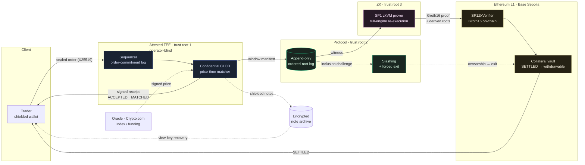

# Arcora Perp

**A custodial testnet alpha for private perpetual-futures trading with ZK-verified state transitions.**

> Test assets only. The gateway holds spending keys and oracle-publisher authority.
> The development prover operator can see plaintext witnesses. This is not a
> non-custodial release or a claim of privacy from the prover operator.

The repository is `arcora-perp` (formerly `dark-perp`). Protocol domain separators
such as `dark-perp:withdraw:` remain unchanged wire formats.

**Source versus deployment:** PR #31 merged as `b2a3c357c6b345726a7a85b5cc55484d6bef8c98`.
Its clock-bound guest/native parity, real SP1 proof and Solidity verification are
recorded in [the source-pinned evidence](docs/audits/2026-10-09-clock-final/README.md).
The July 11 Base Sepolia deployment record uses an older program key. A source
merge does not upgrade that deployment. Runtime version, contract bytecode and
program key must be checked together before treating any website as this source.

The current model proves the implemented state transition. It does not independently
prove user intent, external price truth, honest rejection reasons or matching order.
Permissionless vault claims require an already published withdrawal root and its
Merkle data; an account balance or position does not itself provide an independent
exit. New wind-down roots require the prover and governance.

In clock mode, registration, proving, finality and unresolved recovery pause new
financial requests, including closes, collateral changes, cancellations and
withdrawal requests. Reads and claims against existing roots remain available.
No throughput or maximum pause duration is promised by the source alone.

The full architecture (v2, Turkish) lives in [`docs/ARCHITECTURE.md`](docs/ARCHITECTURE.md).
The design decisions taken while building are in [`docs/DECISIONS.md`](docs/DECISIONS.md),
the phased build plan in [`docs/ROADMAP.md`](docs/ROADMAP.md), the threat model in
[`docs/SECURITY.md`](docs/SECURITY.md), the proving boundary in
[`docs/PROVING.md`](docs/PROVING.md), build/test instructions in
[`docs/TESTING.md`](docs/TESTING.md), the full-codebase adversarial hardening
pass (every fix + what was verified correct) in [`docs/HARDENING.md`](docs/HARDENING.md),
and the economic-security audit (bond sizing, insurance backstop, auto-deleverage,
maker incentives, liquidation privacy — seven hard questions answered head-on) in
[`docs/ECONOMIC_SECURITY.md`](docs/ECONOMIC_SECURITY.md).

## Three trust roots, three layers

The thesis: speed and darkness physically fight; the component that gives both at
practical latency is a TEE — but a TEE **moves** trust, it does not remove it, and
fairness / liveness / recovery are *separate* protocol obligations.

| Root | Provides | Does **not** provide |
|---|---|---|
| **TEE** — low-latency confidential execution | operator-blind matching, native-speed continuous CLOB | liveness, fairness, censorship-resistance, recovery |
| **Protocol** — order-commitment log + forced exit + slashing | sequencing accountability, liveness, fair access | confidentiality, fund validity |
| **ZK** — fund-safety / state-validity root | vault safety, valid state transitions | inclusion / ordering / censorship (on its own) |

If only TEE confidentiality fails, private order/position data can leak while the
proof and vault checks still apply. A broader gateway compromise is different: the
alpha gateway also holds server-custody spend keys and oracle-publisher authority, so
it is a fund-safety and market-integrity trust dependency. ZK rejects transitions
that violate the guest program; it does not turn compromised custody keys or a
gateway-signed false-but-valid oracle transcript into independently authenticated
user intent or external price truth. See the threat model before treating this as a
non-custodial system.

## The hot path, at a glance

How an order flows from a client to L1 settlement, and where each trust root
sits. The ASCII version with full annotations is in
[`docs/ARCHITECTURE.md`](docs/ARCHITECTURE.md) §1.



The solid path is the latency-critical loop; dashed edges are the side flows that
keep the protocol honest when the TEE or operator misbehaves — oracle pricing,
inclusion challenges, forced exit, and view-key recovery from the note archive.

## Recorded testnet deployment (Base Sepolia)

The July 11, 2026 record is in
[`contracts/deployments/base-sepolia.json`](contracts/deployments/base-sepolia.json).
The configured endpoints are [the app](https://perp.arcoralabs.xyz) and
[the documentation site](https://perpdocs.arcoralabs.xyz). These links and recorded
addresses are not current attestation, uptime or source/deployment parity evidence.
The test token is open-mint MockUSDC and has no value.

The gateway has TDX verification code and refuses invalid pinned evidence. The
prover's NVIDIA CC backend is still fail-closed scaffolding, and development proving
uses an explicitly insecure mode. A successful encrypted handshake in a test is not
hardware attestation of a running prover. Matching fairness and truthful rejection
remain outside the guest's proven statement.

## Verification status

Use current command results and the [GitHub delivery and follow-up report](docs/audits/2026-10-09-followup/README.md)
for counts and limitations. The PR #31 real proof remains valid evidence for its
pinned guest; native lifecycle tests using a mock verifier are a separate layer.
A new deployment still requires release identity, full clock proof lifecycle,
capacity measurements and operational acceptance. There is no independent audit
or real-fund release approval.

## Repository status

The workspace includes the deterministic engine, matcher, sequencer, gateway,
prover integrations, vault/settlement contracts and web client. The architecture
below describes code responsibilities, not a certification of a live environment.

| Component | Crate / dir | Phase | Arch |
|---|---|---|---|
| Deterministic state-transition core (note tree, risk, Proof-v1 invariants) | [`crates/perp-core`](crates/perp-core) | 0 | §1,§4,§12 |
| Price-time CLOB matcher (IOC/FOK/post-only/GTC, STP) | [`crates/matcher`](crates/matcher) | 1 | §1,§4 |
| Sequencer spine: receipts, manifests, finality, inclusion slashing, funding/liquidation loop, pre-trade risk, batch rollback | [`crates/sequencer`](crates/sequencer) | 1–3 | §2,§3,§5,§6 |
| ZK proving harness + §10b confidential-proving boundary | [`crates/prover`](crates/prover) | 2 | §4,§10b |
| Encrypted note archive + view-key recovery | [`crates/note-archive`](crates/note-archive) | 2 | §7 |
| L1 settlement: root anchoring, liveness/close-only, bonded inclusion slashing, vault, deploy script | [`contracts/`](contracts) | 2 | §2,§3,§6 |
| Committee-of-enclaves: Shamir t-of-n order keys + quorum preconf | [`crates/committee`](crates/committee) | 5 | §11 |
| Privacy bridge: amount-bucketing + batching/mixing | [`crates/bridge`](crates/bridge) | 4 | §13,§9 |
| End-to-end integration + narrated demo | [`crates/e2e`](crates/e2e), [`crates/demo`](crates/demo) | — | all |
| Running node: live operating loop (oracle → maintenance → seal) | [`crates/node`](crates/node) | — | §5,§8 |
| Order-book stress-test bot (throughput / latency / invariants) | [`crates/loadbot`](crates/loadbot) | — | §1 |
| Live oracle adapter (Crypto.com ticker → `OracleTranscript`) | [`crates/oracle-feed`](crates/oracle-feed) | — | §8 |
| Multi-market web client (finality UX, close/cancel, toasts, responsive), design-ready | [`frontend/`](frontend) | — | §3,§6,§7 |
| CI (Rust + Foundry + frontend) | [`.github/workflows`](.github/workflows) | — | — |

The Rust core and Solidity contracts are bound by **byte-exact cross-layer
vectors** ([`crates/prover/tests/vectors.rs`](crates/prover/tests/vectors.rs) ↔
[`contracts/test/CrossLayer.t.sol`](contracts/test/CrossLayer.t.sol)): a receipt
signed in Rust recovers on-chain via `ecrecover`, and the proof public-input
commitment matches on both sides.

### [`crates/perp-core`](crates/perp-core) — deterministic state-transition core

Written **once**, run in **two** places: natively in the sequencer (hot path) and
**unchanged inside a zkVM guest** (SP1/Risc0 → RISC-V) where it becomes the
Proof-v1 validity circuit. To make that possible it is `#![no_std]` (with
`alloc`), with **no floats, clocks, randomness, or I/O** — every transition is a
pure function of its inputs.

It implements and tests all six **Proof-v1** invariants (§4):

1. **collateral conservation** — `Σ notes + Σ position collateral + insurance + vault_pool == external_in − external_out`, asserted after every op
2. **valid nullifiers / no double-spend** — append-only nullifier set
3. **post-fill margin sufficiency** — increasing side must meet initial margin at the oracle mark
4. **oracle freshness + confidence + deviation** — transcript sanity gates (§8)
5. **funding correctness** — clamped funding rate + cumulative index
6. **liquidation threshold** — equity vs maintenance margin, offline-safe (§5)

Plus the accountability/recovery scaffolding: signed-receipt + batch-manifest
types (§2), three-layer finality `ACCEPTED / MATCHED / SETTLED` where **only
SETTLED is withdrawable** (§3), and a **close-only / forced-exit** mode (§6).

## Build & test

```bash
cargo test --workspace --locked                  # current counts are in the test output
cargo build -p perp-core --no-default-features   # proves the no_std zkVM-guest build
cargo clippy --workspace --all-targets           # clean (-D warnings)
cd frontend && pnpm install --frozen-lockfile && pnpm test && pnpm build
```

The prover-service is a standalone workspace (SP1 SDK isolation); build it from
its own directory: `cd crates/prover-service && cargo build --release`.

## Known limitations (honest, and on the roadmap)

Proof enforcement applies within the guest statement; the alpha retains custody,
price, fairness, privacy and availability dependencies — stated plainly
here and on the [Security & Trust](https://perpdocs.arcoralabs.xyz/security.html) page:

- **The zk prover is not yet TEE-attested.** Real SP1/Groth16 proofs settle on-chain,
  but the prover runs on a development machine with a stub measurement. The witness
  leaves the sequencer enclave sealed, yet the prover host's integrity isn't
  hardware-attested — so "even the operator can't see balances" does not yet hold for
  the prover. Proof validation remains separate from custody and oracle compromise risk.
  Roadmap: attestation-gated key release to an x86_64 TDX prover.
- **Operator liveness is a single point of failure.** If the sequencer stops, trading
  halts. Existing published withdrawal claims remain usable with their Merkle data;
  new exits still require operator/prover service and governance during final wind-down.
  Roadmap: cloud deployment + hot-standby.
- **Matching fairness is not yet proven in ZK.** The proof attests correct *execution*
  of the sequenced ops; the *ordering* is enclave-attested only, backed by signed
  receipts + inclusion challenges + slashing. Roadmap: Proof v2.
- **Clock admission pauses during settlement.** Historical proof timings are not a
  bound for the current guest, load or chain finality. One full-state witness is proved per window. Roadmap:
  GPU proving + sparse witness (proof cost independent of total account count).
- **No third-party audit yet.** Contracts + circuits were hardened through internal
  adversarial passes (findings fixed with regression tests); an external audit is a
  mainnet prerequisite.
- **Aztec privacy bridge** (Phase 4) and **committee-of-enclaves** (Phase 5) remain
  future phases.

See [`docs/ROADMAP.md`](docs/ROADMAP.md) for the full phase map and the
[technical brief](docs/litepaper/arcora-perp-litepaper.md) for the design in depth.
