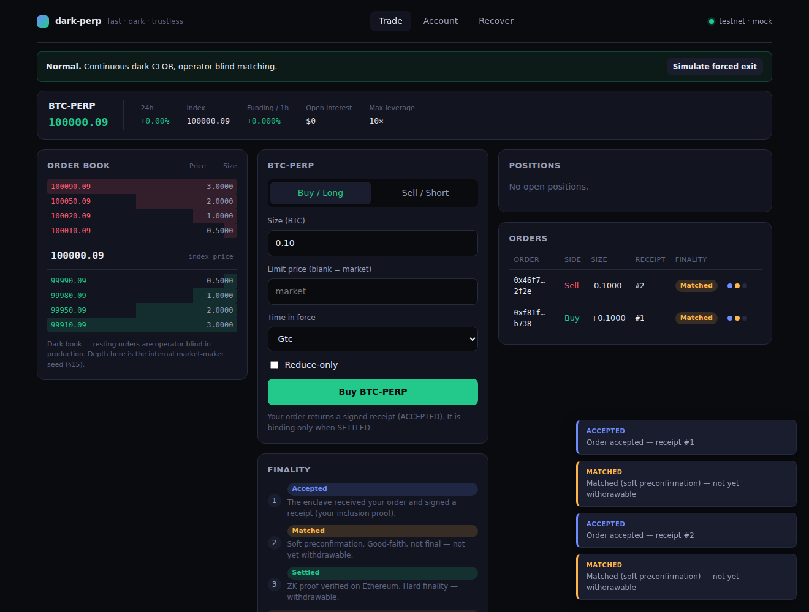

# frontend — dark-perp web client

A runnable Vite + React + TypeScript app with a complete, polished default design,
**ready for your design to be applied on top**.

 It already encodes the protocol's domain model and the parts of the UX
that the architecture pins down — most importantly the three-layer finality
(§3) — so a reskin is a styling pass, not a rebuild.

## Run

```bash
cd frontend
pnpm install
pnpm dev        # http://localhost:5173
pnpm build      # type-check (strict) + production build
pnpm test       # vitest — 16 unit tests
```

The tests guard the correctness-critical, design-independent layer: the
fixed-point `format`/`parse` round-trips (`src/domain/format.test.ts`) and the mock
client's position lifecycle — open, **flip** (entry resets on a cross-zero fill),
close-to-flat, close-only gating, withdrawal limits (`src/api/mockClient.test.ts`).
A reskin touches none of this, so the suite stays green across design changes.

## How the design slots in

- **Tokens, not hard-coded values.** All colour/spacing/typography live as CSS
  variables in `src/styles.css` `:root`. The design overrides those variables;
  components reference tokens only, so the structure is untouched.
- **Components are presentational + dumb.** Each component in `src/components/`
  reads from the store and renders. Restyle freely; keep the data they show.

## What's wired (faithful to the protocol)

| Area | File | Arch |
|---|---|---|
| Domain types + fixed-point scales | `src/domain/types.ts` | mirrors `perp-core` |
| Formatting/parsing (no floats) | `src/domain/format.ts` | §12 |
| Pre-trade risk math (notional/margin/leverage/liq/buying-power/equity) | `src/domain/risk.ts` | §12 |
| Live oracle feed (Crypto.com index, graceful fallback) | `src/api/oracleFeed.ts` | §8 |
| Client interface | `src/api/client.ts` | swap mock → real |
| Mock client (5 USDC markets, live oracle, finality, close-only, recovery) | `src/api/mockClient.ts` | §2, §3, §6, §7, §8 |
| Finality legend + per-order progress | `src/components/FinalityTracker.tsx` | §3 |
| Order ticket (Buy/Sell, TIF, reduce-only, quick-size, live risk preview, click-to-price) | `src/components/OrderTicket.tsx` | §1, §4 |
| Live index price chart (dependency-free SVG) | `src/components/PriceChart.tsx` | §8 |
| Account margin summary (equity/used/free/uPnL/leverage) | `src/components/AccountPanel.tsx` | §3 |
| Persistent order-activity feed | `src/components/ActivityFeed.tsx` | §3 |
| Live index price chart (dependency-free SVG sparkline) | `src/components/PriceChart.tsx` | §8 |
| Order book (dark-book framing) | `src/components/OrderBook.tsx` | §15 |
| Positions / orders tables | `src/components/Tables.tsx` | §3, §5 |
| Account: deposit / withdraw (SETTLED-gated) | `src/components/AccountPanel.tsx` | §3, §6 |
| Recovery: seed → view-key scan | `src/components/RecoveryPanel.tsx` | §7 |
| Close-only / forced-exit banner | `src/components/ModeBanner.tsx` | §6 |

## Non-negotiable UX invariants (must survive any restyle)

- **MATCHED ≠ SETTLED.** Only SETTLED is withdrawable; the UI must never imply a
  matched order is final (§3). `isWithdrawable()` and `FINALITY_COPY` encode this.
- **Close-only is loud.** When the system is close-only, opening is blocked and the
  user is told they can only exit (§6).
- **No floats in money math.** Amounts are scaled `bigint`; only display strings
  are decimal (§12).

## Replacing the mock

Implement `DarkPerpClient` (`src/api/client.ts`) against the real sequencer
(orders/receipts) and L1 + note archive (settlement/recovery), then swap the one
line in `src/store.tsx`. No component changes required.
